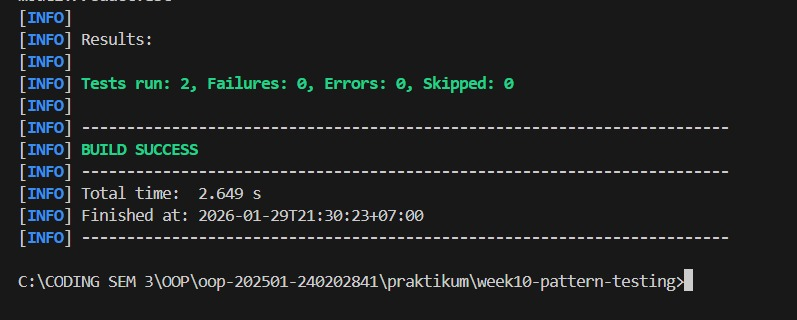
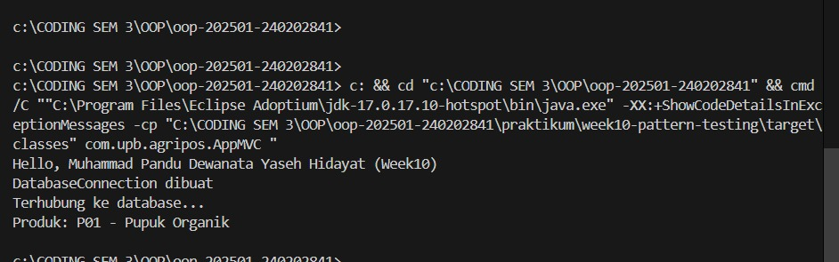

# Laporan Praktikum Minggu 10

Topik: Design Pattern (Singleton, MVC) dan Unit Testing menggunakan JUnit

## Identitas

* Nama  : Muhammad Pandu Dewanata Yaseh Hidayat
* NIM   : 240202841
* Kelas : 3IKRA

---

## Tujuan

Tujuan dari praktikum minggu ke-10 ini adalah agar mahasiswa memahami konsep dasar design pattern, khususnya Singleton dan Model–View–Controller (MVC), serta mampu mengimplementasikannya pada aplikasi Java sederhana. Selain itu, mahasiswa diharapkan mampu membuat dan menjalankan unit testing menggunakan JUnit untuk memastikan kode berjalan sesuai dengan yang diharapkan.

---

## Dasar Teori

1. Design pattern merupakan solusi umum yang telah teruji untuk menyelesaikan permasalahan berulang dalam pengembangan perangkat lunak.
2. Singleton Pattern digunakan untuk memastikan bahwa suatu class hanya memiliki satu instance selama aplikasi berjalan.
3. MVC (Model–View–Controller) memisahkan antara data, tampilan, dan logika kontrol agar kode lebih terstruktur.
4. Unit testing bertujuan untuk menguji bagian terkecil dari program secara terisolasi.
5. JUnit adalah framework testing pada Java yang digunakan untuk membuat dan menjalankan unit test.

---

## Langkah Praktikum

1. Menyiapkan struktur project praktikum week10-pattern-testing menggunakan Maven.
2. Membuat class DatabaseConnection dengan menerapkan Singleton Pattern.
3. Mengimplementasikan pola MVC pada fitur Product yang terdiri dari Model, View, dan Controller.
4. Membuat class utama (AppMVC) untuk mengintegrasikan seluruh komponen MVC.
5. Membuat unit test menggunakan JUnit untuk menguji fungsi pada class Product.
6. Menjalankan unit test menggunakan perintah mvn test dan memastikan seluruh test berjalan sukses.
7. Melakukan commit dengan message: week10-pattern-testing: implement singleton, mvc, dan junit test.

---

## Kode Program

Contoh integrasi MVC pada program utama:

```java
package com.upb.agripos;

import com.upb.agripos.config.DatabaseConnection;
import com.upb.agripos.controller.ProductController;
import com.upb.agripos.model.Product;
import com.upb.agripos.view.ConsoleView;

public class AppMVC {
    public static void main(String[] args) {

        System.out.println("Hello, Muhammad Pandu Dewanata Yaseh Hidayat (Week10)");

        // Singleton test
        DatabaseConnection db1 = DatabaseConnection.getInstance();
        db1.connect();

        // MVC
        Product product = new Product("P01", "Pupuk Organik");
        ConsoleView view = new ConsoleView();
        ProductController controller = new ProductController(product, view);

        controller.showProduct();
    }
}
```


---

## Hasil Eksekusi

Hasil eksekusi program menampilkan data produk melalui ConsoleView. Selain itu, hasil unit testing menggunakan JUnit menunjukkan bahwa seluruh test berhasil dijalankan tanpa error.




---

## Analisis

Pada praktikum ini, program berjalan dengan memanfaatkan pola MVC, di mana data produk disimpan pada Model, tampilan ditangani oleh View, dan alur logika dikontrol oleh Controller. Pendekatan ini berbeda dengan minggu sebelumnya yang masih menggabungkan logika dan tampilan dalam satu class.

Penerapan Singleton memastikan bahwa koneksi database hanya dibuat satu kali sehingga lebih efisien dan aman. Unit testing menggunakan JUnit membantu memastikan bahwa method pada class Product berjalan sesuai dengan yang diharapkan.

Kendala yang dihadapi adalah kesalahan konfigurasi package pada awal pembuatan unit test, namun dapat diatasi dengan menyesuaikan struktur direktori dan import class yang benar.

---

## Kesimpulan

Berdasarkan praktikum minggu ke-10, dapat disimpulkan bahwa penerapan design pattern seperti Singleton dan MVC mampu membuat struktur program menjadi lebih rapi, terorganisir, dan mudah dikembangkan. Selain itu, penggunaan unit testing dengan JUnit sangat membantu dalam menjaga kualitas dan keandalan kode program.

---

## Quiz

1. Mengapa constructor pada Singleton harus bersifat private?
   **Jawaban:** Agar objek dari class tersebut tidak dapat dibuat secara langsung dari luar class, sehingga jumlah instance dapat dikontrol.

2. Jelaskan manfaat pemisahan Model, View, dan Controller.
   **Jawaban:** Pemisahan ini membuat kode lebih terstruktur, mudah dipelihara, dan memudahkan pengembangan serta pengujian.

3. Apa peran unit testing dalam menjaga kualitas perangkat lunak?
   **Jawaban:** Unit testing membantu mendeteksi kesalahan lebih awal dan memastikan setiap fungsi berjalan sesuai spesifikasi.

4. Apa risiko jika Singleton tidak diimplementasikan dengan benar?
   **Jawaban:** Dapat menyebabkan lebih dari satu instance terbentuk, yang berpotensi menimbulkan inkonsistensi data dan pemborosan resource.
