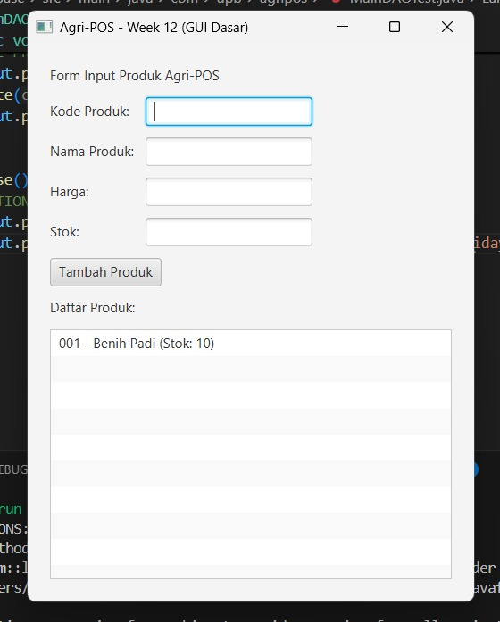

# Laporan Praktikum Minggu 12

Topik: GUI Dasar JavaFX (Event-Driven Programming)

## Identitas

* Nama  : Muhammad Pandu Dewanata Yaseh Hidayat
* NIM   : 240202841
* Kelas : 3IKRA

---

## Tujuan

Tujuan dari praktikum minggu ke-12 ini adalah agar mahasiswa memahami konsep event-driven programming serta mampu membangun antarmuka grafis sederhana menggunakan JavaFX. Mahasiswa juga diharapkan dapat mengintegrasikan GUI dengan backend aplikasi yang telah dibuat sebelumnya menggunakan DAO dan Service.

---

## Dasar Teori

1. Event-driven programming adalah paradigma pemrograman yang alur eksekusinya dipicu oleh suatu event, seperti klik tombol.
2. JavaFX merupakan framework Java untuk membangun aplikasi berbasis GUI.
3. MVC (Model–View–Controller) memisahkan logika data, tampilan, dan kontrol aplikasi.
4. Service berfungsi sebagai penghubung antara Controller dan DAO.
5. Pemisahan layer aplikasi mendukung prinsip SOLID, khususnya Dependency Inversion Principle (DIP).

---

## Langkah Praktikum

1. Menyiapkan project JavaFX pada direktori praktikum week12-gui-dasar.
2. Menggunakan kembali class Product, ProductDAO, dan ProductService dari praktikum sebelumnya.
3. Membuat form GUI JavaFX untuk input data produk.
4. Menambahkan event handler pada tombol Tambah Produk.
5. Menghubungkan event GUI dengan ProductController dan ProductService.
6. Menampilkan data produk hasil input pada ListView.
7. Menjalankan aplikasi dan mendokumentasikan hasil GUI.
8. Melakukan commit dengan message: week12-gui-dasar: implementasi gui dasar javafx.

---

## Kode Program

Contoh event handling pada JavaFX:

```java
package com.upb.agripos;

import java.sql.Connection;
import java.sql.DriverManager;

import com.upb.agripos.controller.ProductController;
import com.upb.agripos.dao.ProductDAO;
import com.upb.agripos.dao.ProductDAOImpl;
import com.upb.agripos.service.ProductService;
import com.upb.agripos.view.ProductFormView;

import javafx.application.Application;
import javafx.scene.Scene;
import javafx.stage.Stage;

public class AppJavaFX extends Application {

    @Override
    public void start(Stage stage) {
        try {
            Class.forName("org.postgresql.Driver");
            //  Database Connection
            Connection conn = DriverManager.getConnection(
                "jdbc:postgresql://localhost:5432/agripos", "postgres", "123456"
            );

            // 2.  MVC Components
            ProductDAO dao = new ProductDAOImpl(conn);
            ProductService service = new ProductService(dao);
            ProductFormView view = new ProductFormView();
            new ProductController(service, view); // Controller menghubungkan View & Service

            // 3. Setup Scene & Stage
            Scene scene = new Scene(view, 400, 500);
            stage.setTitle("Agri-POS - Week 12 (GUI Dasar)");
            stage.setScene(scene);
            stage.show();
        } catch (Exception e) {
            e.printStackTrace();
        }
    }

    public static void main(String[] args) {
        Application.launch(args);
    }
}
```

---

## Hasil Eksekusi

Aplikasi JavaFX berhasil dijalankan dan menampilkan form input produk. Saat tombol Tambah Produk ditekan, data produk berhasil disimpan melalui backend dan ditampilkan pada ListView.



---

## Analisis

Pada praktikum ini, GUI JavaFX bertindak sebagai View yang hanya menangani interaksi pengguna. Event tombol Tambah memicu Controller untuk memproses data dan meneruskannya ke Service, yang kemudian memanggil DAO untuk menyimpan data ke database.

Pendekatan ini berbeda dengan praktikum sebelumnya yang masih berbasis console, karena pada minggu ini aplikasi sudah bersifat visual dan event-driven. Kendala yang dihadapi adalah validasi input dan konversi tipe data, namun dapat diatasi dengan pengecekan input sebelum diproses.

---

## Kesimpulan

Berdasarkan praktikum minggu ke-12, dapat disimpulkan bahwa JavaFX mendukung pembuatan GUI yang interaktif dan terintegrasi dengan backend aplikasi. Dengan pendekatan MVC dan event-driven programming, aplikasi menjadi lebih terstruktur dan mudah dikembangkan.

---

## Quiz

1. Apa yang dimaksud dengan event-driven programming?
   **Jawaban:** Paradigma pemrograman yang alur programnya ditentukan oleh event atau aksi pengguna.

2. Mengapa GUI tidak boleh memanggil DAO secara langsung?
   **Jawaban:** Agar pemisahan tanggung jawab tetap terjaga dan sesuai prinsip SOLID, khususnya DIP.

3. Apa peran ProductService dalam arsitektur aplikasi?
   **Jawaban:** Sebagai penghubung antara Controller dan DAO untuk mengelola logika bisnis.

---

## Tabel Traceability Bab 6 ke GUI

| Artefak Bab 6 | Referensi           | Handler GUI   | Controller/Service                                | DAO                 | Dampak UI/DB                  |
| ------------- | ------------------- | ------------- | ------------------------------------------------- | ------------------- | ----------------------------- |
| Use Case      | UC-01 Tambah Produk | Tombol Tambah | ProductController.add() → ProductService.insert() | ProductDAO.insert() | UI bertambah & data tersimpan |
| Activity      | AD-01 Tambah Produk | Tombol Tambah | Validasi → Simpan                                 | Insert Product      | Data tampil di ListView       |
| Sequence      | SD-01 Tambah Produk | Tombol Tambah | View→Controller→Service                           | DAO→DB              | Alur sesuai diagram           |
