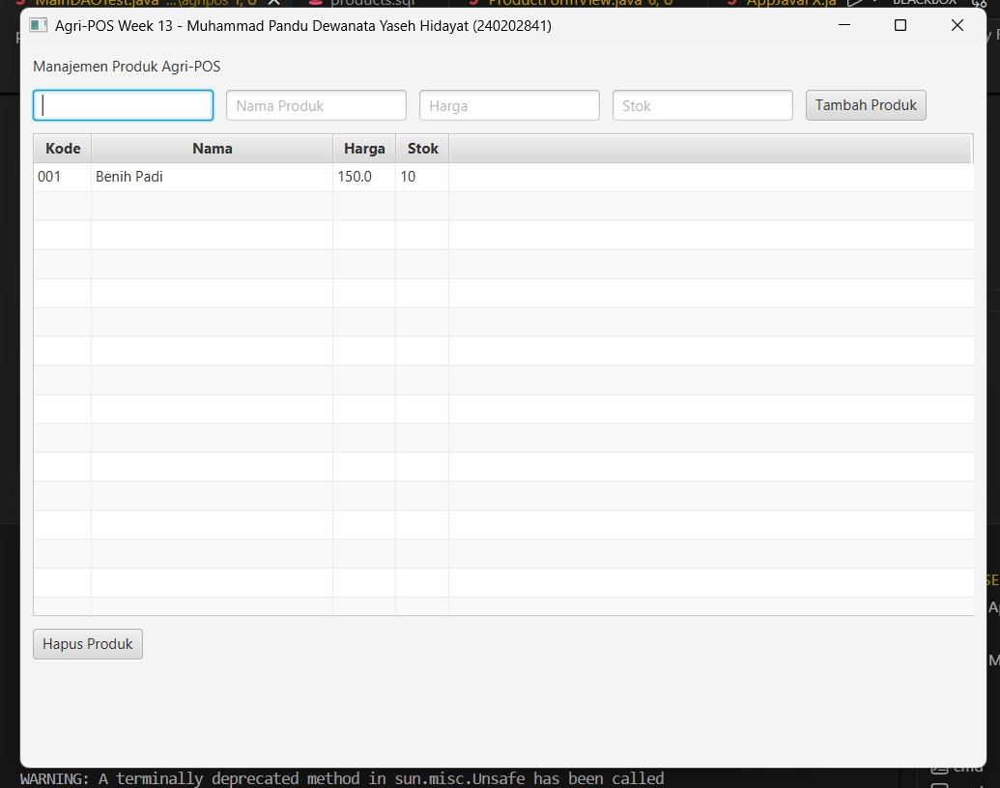

# Laporan Praktikum Minggu 13

Topik: GUI Lanjutan JavaFX (TableView dan Lambda Expression)

## Identitas

* Nama  : Muhammad Pandu Dewanata Yaseh Hidayat
* NIM   : 240202841
* Kelas : 3IKRA

---

## Tujuan

Tujuan dari praktikum minggu ke-13 ini adalah agar mahasiswa mampu menampilkan data menggunakan TableView JavaFX, mengintegrasikan data dari database melalui DAO dan Service, serta menerapkan lambda expression dalam event handling untuk membangun GUI Agri-POS yang lebih interaktif dan terstruktur.

---

## Dasar Teori

1. TableView adalah komponen JavaFX yang digunakan untuk menampilkan data dalam bentuk tabel.
2. Lambda expression digunakan untuk menuliskan event handler secara ringkas dan mudah dibaca.
3. ObservableList berfungsi sebagai penghubung data backend dengan komponen GUI.
4. Arsitektur MVC memisahkan View, Controller, Service, dan DAO.
5. Dependency Inversion Principle (DIP) memastikan View tidak berinteraksi langsung dengan database.

---

## Langkah Praktikum

1. Melanjutkan project dari praktikum minggu ke-12 tanpa membuat project baru.
2. Mengubah tampilan daftar produk dari ListView menjadi TableView.
3. Membuat kolom TableView untuk kode, nama, harga, dan stok produk.
4. Menghubungkan TableView dengan data dari database melalui ProductService.
5. Menambahkan tombol Tambah Produk dan Hapus Produk.
6. Menggunakan lambda expression pada event handler tombol.
7. Menjalankan aplikasi dan menguji fitur tambah dan hapus produk.
8. Mendokumentasikan hasil GUI dan melakukan commit dengan message: week13-gui-lanjutan: implementasi tableview dan lambda.

---

## Kode Program

Contoh event handler menggunakan lambda expression:

```java
package com.upb.agripos;

import java.sql.Connection;
import java.sql.DriverManager;

import com.upb.agripos.controller.ProductController;
import com.upb.agripos.dao.ProductDAO;
import com.upb.agripos.dao.ProductDAOImpl;
import com.upb.agripos.service.ProductService;
import com.upb.agripos.view.ProductTableView;

import javafx.application.Application;
import javafx.scene.Scene;
import javafx.stage.Stage;

public class AppJavaFX extends Application {

    @Override
    public void start(Stage stage) {
        try {
            // 1. Setup Database Connection
            Connection conn = DriverManager.getConnection(
                "jdbc:postgresql://localhost:5432/agripos", "postgres", "123456"
            );

            // 2. Setup MVC 
            ProductDAO dao = new ProductDAOImpl(conn);
            ProductService service = new ProductService(dao);
            ProductTableView view = new ProductTableView();
            new ProductController(service, view);

            // 3. Show Scene
            Scene scene = new Scene(view, 800, 600);
            stage.setTitle("Agri-POS Week 13 - Muhammad Pandu Dewanata Yaseh Hidayat (240202841)");
            stage.setScene(scene);
            stage.show();

        } catch (Exception e) {
            e.printStackTrace();
        }
    }

    public static void main(String[] args) {
        launch(args);
    }
}
```

---

## Hasil Eksekusi

Aplikasi JavaFX berhasil menampilkan data produk dalam bentuk TableView. Data diambil langsung dari database PostgreSQL. Fitur tambah dan hapus produk berjalan dengan baik, serta perubahan data langsung tercermin pada tampilan GUI.



---

## Analisis

Pada praktikum ini, TableView berperan sebagai View yang menampilkan data produk secara terstruktur. Method loadData() pada Controller memanggil ProductService untuk mengambil data dari DAO dan mengisi ObservableList yang terhubung dengan TableView.

Pendekatan ini merupakan pengembangan dari praktikum minggu ke-12 yang sebelumnya masih menggunakan ListView. Kendala yang dihadapi adalah pengaturan kolom TableView dan binding data, namun dapat diatasi dengan penggunaan PropertyValueFactory dan ObservableList.

---

## Kesimpulan

Berdasarkan praktikum minggu ke-13, dapat disimpulkan bahwa penggunaan TableView dan lambda expression membuat aplikasi JavaFX menjadi lebih interaktif dan efisien. Integrasi penuh antara GUI, Service, dan DAO memastikan data selalu sinkron dengan database.

---

## Quiz

1. Apa fungsi utama TableView pada JavaFX?
   **Jawaban:** Untuk menampilkan data dalam bentuk tabel yang terstruktur dan mudah dibaca.

2. Mengapa lambda expression digunakan pada event handling?
   **Jawaban:** Agar kode event handler lebih ringkas, jelas, dan mudah dipahami.

3. Mengapa View tidak boleh memanggil DAO secara langsung?
   **Jawaban:** Untuk menjaga pemisahan tanggung jawab dan menerapkan prinsip SOLID, khususnya DIP.

---


