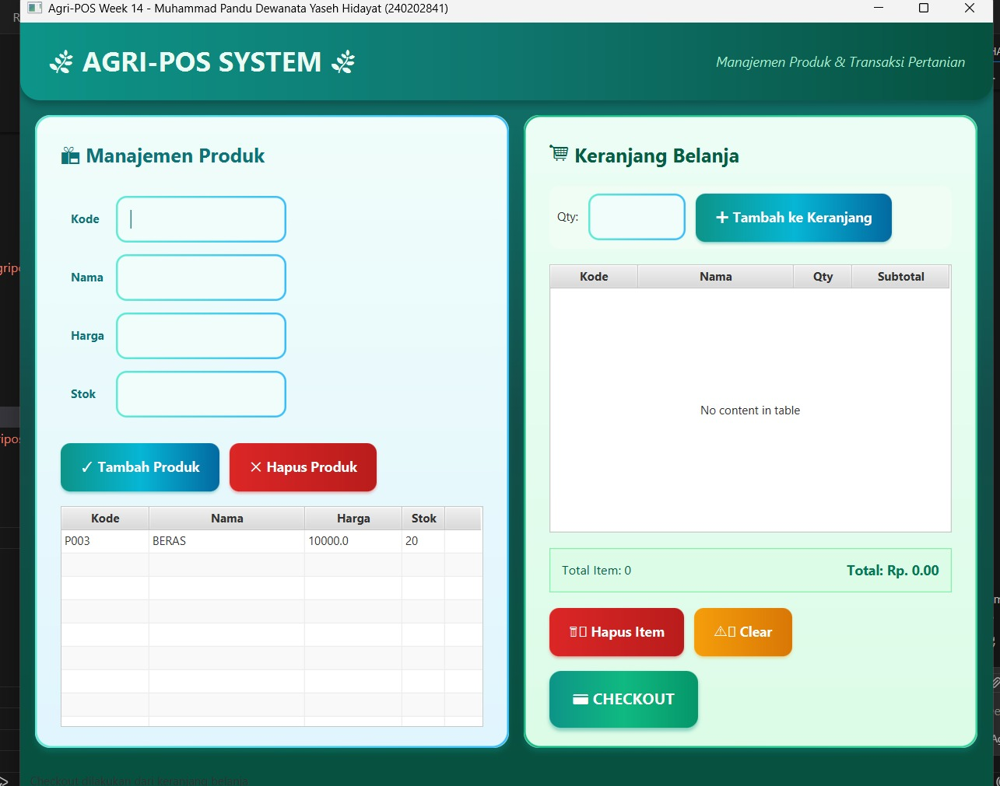
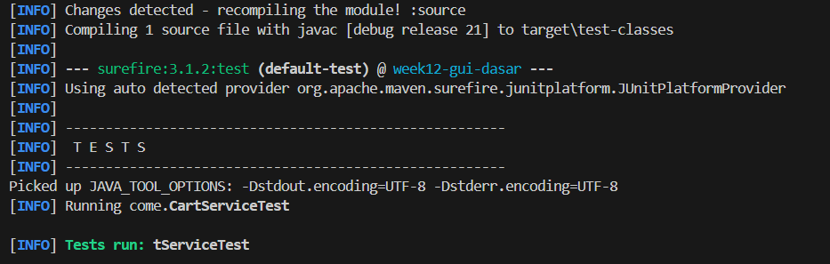

# Laporan Praktikum Minggu 14

Topik: Integrasi Individu (OOP + Database + GUI)

## Identitas

* Nama  : Muhammad Pandu Dewanata Yaseh Hidayat
* NIM   : 240202841
* Kelas : 3IKRA

---

## Tujuan

Praktikum minggu ke-14 bertujuan untuk mengintegrasikan seluruh materi dari Bab 1 sampai Bab 13 ke dalam satu aplikasi individu bernama **Agri-POS**. Mahasiswa diharapkan mampu menerapkan konsep OOP, UML dan SOLID, Collections, exception handling, design pattern, unit testing, database (JDBC), serta GUI JavaFX dalam satu aplikasi yang berjalan secara end-to-end.

---

## Dasar Teori

1. Object Oriented Programming (OOP) digunakan untuk membangun aplikasi yang modular dan mudah dikembangkan.
2. Arsitektur MVC memisahkan View, Controller, Service, dan DAO agar kode terstruktur dan sesuai prinsip SOLID.
3. DAO dan JDBC digunakan untuk mengelola akses data ke database PostgreSQL.
4. Collections dimanfaatkan untuk mengelola data keranjang belanja secara dinamis.
5. JavaFX digunakan sebagai antarmuka pengguna yang terhubung langsung dengan backend aplikasi.

---

## Langkah Praktikum

1. Melanjutkan project Agri-POS dari Bab 1–13 tanpa membuat project baru.
2. Mengintegrasikan fitur produk (CRUD) dengan database PostgreSQL menggunakan DAO dan JDBC.
3. Mengimplementasikan keranjang belanja menggunakan Collections.
4. Menerapkan exception handling untuk validasi input produk dan alur error.
5. Menggunakan minimal satu design pattern (Singleton untuk koneksi database).
6. Menambahkan unit test JUnit untuk menguji logika non-UI.
7. Menghubungkan seluruh fitur ke tampilan JavaFX.
8. Menjalankan aplikasi dan melakukan pengujian menyeluruh.
9. Melakukan commit dengan message:
   `week14-integrasi-individu: integrasi oop database gui dan testing`.

---

## Kode Program

Contoh integrasi Controller, Service, dan DAO pada fitur tambah produk:

```java
package com.upb.agripos;

import java.sql.Connection;
import java.sql.DriverManager;

import com.upb.agripos.controller.PosController;
import com.upb.agripos.dao.ProductDAO;
import com.upb.agripos.dao.ProductDAOImpl;
import com.upb.agripos.service.CartService;
import com.upb.agripos.service.ProductService;
import com.upb.agripos.view.PosView;

import javafx.application.Application;
import javafx.scene.Scene;
import javafx.stage.Stage;

public class AppJavaFX extends Application {

    @Override
    public void start(Stage stage) {
        try {
            // Cetak identitas ke console (sesuai Bab 1)
            System.out.println("Hello World, I am Muhammad Pandu Dewanata Yaseh Hidayat -240202841mv");

            // 1. Setup Database Connection (Bab 11)
            Connection conn = DriverManager.getConnection(
                "jdbc:postgresql://localhost:5432/agripos_db", 
                "postgres", 
                "123456"
            );

            // 2. Setup MVC + Service + DAO Architecture (Bab 6, 11, 12, 13)
            ProductDAO productDAO = new ProductDAOImpl(conn);
            ProductService productService = new ProductService(productDAO);
            CartService cartService = new CartService(productService);

            // 3. Create View (Bab 12-13)
            PosView view = new PosView();

            // 4. Create Controller (Bab 12-13)
            new PosController(productService, cartService, view);

            // 5. Display Scene
            Scene scene = new Scene(view, 1000, 800);
            stage.setTitle("Agri-POS Week 14 - Muhammad Pandu Dewanata Yaseh Hidayat (240202841)");
            stage.setScene(scene);
            stage.show();

        } catch (Exception e) {
            System.err.println("Error starting application: " + e.getMessage());
            e.printStackTrace();
        }
    }

    public static void main(String[] args) {
        launch(args);
    }
}
```

Contoh penggunaan Collections pada keranjang:

```java
cartService.addItem(product, qty);
```

---

## Hasil Eksekusi

Aplikasi Agri-POS berhasil dijalankan menggunakan JavaFX. Data produk dapat ditampilkan, ditambahkan, dan dihapus dari database PostgreSQL. Keranjang belanja dapat menampung produk yang dipilih dan menghitung total belanja dengan benar. Unit test JUnit berhasil dijalankan tanpa error.




---

## Analisis

Pada praktikum ini, seluruh komponen aplikasi saling terhubung secara end-to-end. View (JavaFX) hanya berperan sebagai antarmuka dan memicu aksi, sedangkan logika bisnis dikelola oleh Service dan akses data ditangani oleh DAO. Keranjang belanja memanfaatkan Collections sehingga data dapat dikelola secara fleksibel tanpa bergantung pada database.

Dibandingkan praktikum sebelumnya, Bab 14 menekankan integrasi penuh antar modul, bukan hanya implementasi fitur secara terpisah. Kendala utama yang dihadapi adalah menjaga konsistensi nama kelas dan metode dengan UML Bab 6, namun dapat diatasi dengan penyesuaian struktur kode.

---

## Kesimpulan

Berdasarkan praktikum minggu ke-14, dapat disimpulkan bahwa integrasi OOP, database, dan GUI menghasilkan aplikasi yang utuh dan siap digunakan. Penerapan SOLID, DAO, Collections, dan JavaFX membuat aplikasi Agri-POS lebih terstruktur, mudah dikembangkan, dan sesuai standar pemrograman berorientasi objek.

---

## Quiz

1. Mengapa View tidak boleh mengakses DAO secara langsung?
   **Jawaban:** Untuk menjaga pemisahan tanggung jawab dan menerapkan prinsip Dependency Inversion.

2. Apa fungsi Collections pada fitur keranjang?
   **Jawaban:** Untuk menyimpan dan mengelola data item keranjang secara dinamis.

3. Mengapa unit testing tidak dilakukan pada layer GUI?
   **Jawaban:** Karena pengujian difokuskan pada logika bisnis non-UI agar lebih mudah dan stabil.

---

