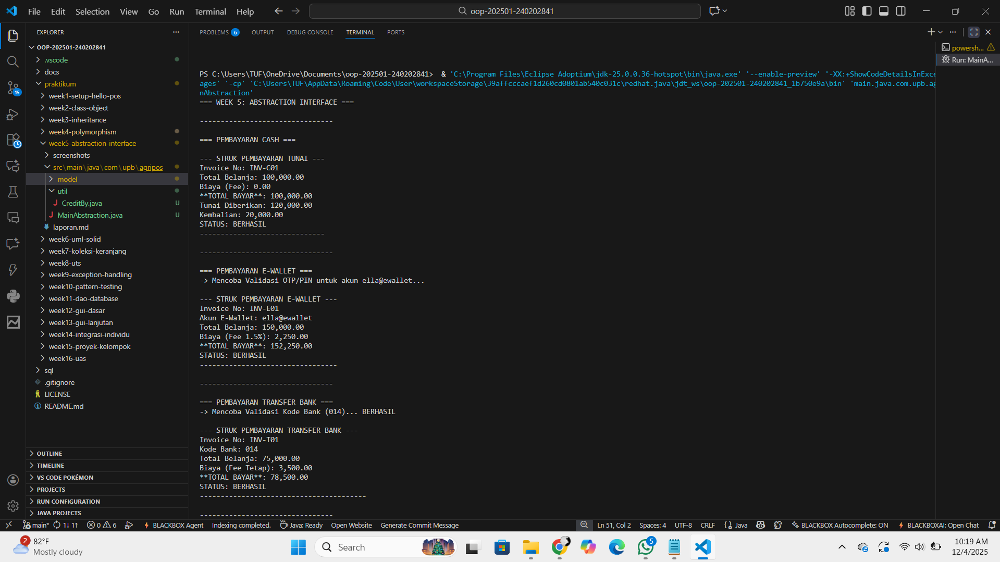
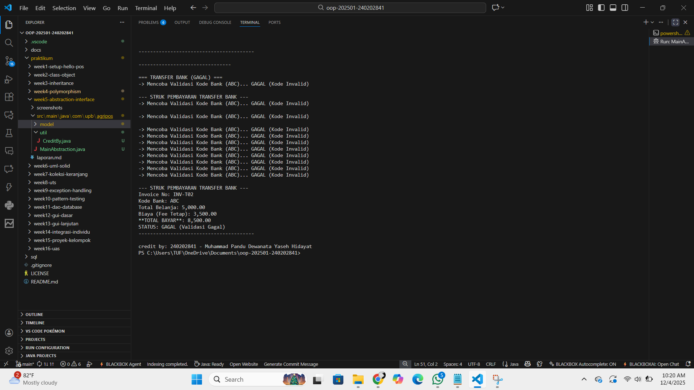

# Laporan Praktikum Minggu 5
Topik: Abstraction dan Interface dalam Sistem Pembayaran

## Identitas
- Nama  : Muhammad Pandu Dewanata Yaseh Hidayat
- NIM   : 240202841
- Kelas : 3IKRA

---

## Tujuan
Mahasiswa memahami konsep abstraction dan interface dalam OOP serta dapat menerapkannya pada studi kasus sistem pembayaran (Cash, E-Wallet, dan Transfer Bank) menggunakan Java.
---

## Dasar Teori
1. Abstraction
   Abstraksi digunakan untuk menyederhanakan bagian–bagian program yang rumit. Kita hanya menampilkan hal-hal penting yang perlu dipakai, sementara detail prosesnya disembunyikan. Di Java, konsep ini biasanya diwujudkan melalui abstract class dan method abstract.

2. Interface
   Interface berfungsi sebagai aturan atau pedoman yang harus diikuti oleh class lain. Setiap class yang mengimplementasikan interface wajib menyediakan isi dari method yang ada di dalamnya, sehingga perilaku antar class bisa seragam.

3. Polymorphism
   Konsep ini memungkinkan satu bentuk method dipakai oleh berbagai objek, tetapi hasilnya bisa berbeda-beda sesuai implementasi masing-masing class. Polymorphism membuat program lebih fleksibel.

4. Override Method
   Method overriding terjadi ketika subclass menulis ulang method milik class induk untuk menyesuaikan perilakunya dengan kebutuhan spesifik.

5. Validasi dan Implementasi Pembayaran
   Pada sistem pembayaran, tiap metode seperti cash, e-wallet, dan transfer bank punya aturan yang berbeda. Meski begitu, semuanya tetap mengikuti kerangka dasar yang sama karena diatur oleh abstraksi atau interface.

---

## Langkah Praktikum
1. Menyiapkan struktur project
   Membuat folder dan package yang dibutuhkan untuk menampung class-class pembayaran, seperti class abstrak, interface, serta class konkret untuk setiap metode pembayaran.

2. Membangun kerangka dasar pembayaran
   Membuat abstract class dan interface yang berisi aturan umum proses pembayaran, seperti validasi, perhitungan total, dan pencetakan struk.

3. Membuat class pembayaran sesuai jenisnya
   Menuliskan kode untuk CashPayment, EWalletPayment, dan BankTransferPayment, lengkap dengan aturan masing-masing seperti validasi OTP dan pengecekan kode bank.

5. Membuat file Main untuk menjalankan program
   Menyusun class MainAbstraction sebagai tempat uji coba seluruh metode pembayaran, lalu menjalankan program untuk memastikan setiap jenis pembayaran berjalan sesuai logika yang sudah ditentukan.

6. Melakukan testing program
   Menjalankan kode dan mengamati hasil di terminal, baik pembayaran yang berhasil maupun yang gagal, untuk mengecek apakah struktur abstraksi dan interface sudah bekerja dengan benar.

7. Commit ke repository
   Setelah semuanya berjalan, melakukan commit dengan pesan yang menggambarkan perubahan, misalnya:
   "Menambahkan implementasi abstraction & interface pada sistem pembayaran"

---

## Kode Program
```java
//KONTRAK
```
```java
//Receiptable.java
package main.java.com.upb.agripos.model.kontrak;

public interface Receiptable{
    String cetakStruk();
}

//Validatable
package main.java.com.upb.agripos.model.kontrak;

public interface Validatable {
    boolean validasi();
}
```
```java
//PEMBAYARAN
```
```java
//Cash.java
package main.java.com.upb.agripos.model.pembayaran;

import main.java.com.upb.agripos.model.kontrak.Receiptable;

public class Cash extends Pembayaran implements Receiptable {
    private double tunai;

    public Cash(String invoiceNo, double total, double tunai) {
        super(invoiceNo, total);
        this.tunai = tunai;
    }

    @Override
    public double biaya() {
        return 0.0;
    }

    @Override
    public boolean prosesPembayaran() {
        return tunai >= totalBayar(); // Berhasil jika cukup uang tunai
    }

    @Override
    public String cetakStruk() {
        boolean berhasil = prosesPembayaran();
        String status = berhasil ? "BERHASIL" : "GAGAL (Tunai Kurang)";
        double kembalian = berhasil ? (tunai - totalBayar()) : 0.0;
        
        return "\n--- STRUK PEMBAYARAN TUNAI ---\n" +
               "Invoice No: " + invoiceNo + "\n" +
               "Total Belanja: " + String.format("%,.2f", total) + "\n" +
               "Biaya (Fee): " + String.format("%,.2f", biaya()) + "\n" +
               "**TOTAL BAYAR**: " + String.format("%,.2f", totalBayar()) + "\n" +
               "Tunai Diberikan: " + String.format("%,.2f", tunai) + "\n" +
               "Kembalian: " + String.format("%,.2f", kembalian) + "\n" +
               "STATUS: " + status +
               "\n------------------------------";
    }
}

```
```java
//EWallet.java
package main.java.com.upb.agripos.model.pembayaran;

import main.java.com.upb.agripos.model.kontrak.Validatable;
import main.java.com.upb.agripos.model.kontrak.Receiptable;

public class EWallet extends Pembayaran implements Validatable, Receiptable {
    private String akun;
    private String otp; 
    private boolean isProcessed = false; // <-- FIELD BARU untuk Status
    private boolean statusPembayaran = false; // <-- FIELD BARU untuk Hasil Proses

    public EWallet(String invoiceNo, double total, String akun, String otp) {
        super(invoiceNo, total);
        this.akun = akun;
        this.otp = otp;
    }

    @Override
    public double biaya() {
        return total * 0.015;
    }

    @Override
    public boolean validasi() {
        System.out.println("-> Mencoba Validasi OTP/PIN untuk akun " + akun + "...");
        return otp != null && otp.length() == 6; 
    }

    @Override
    public boolean prosesPembayaran() {
        // Hanya proses jika belum pernah diproses
        if (!isProcessed) {
            this.statusPembayaran = validasi(); // Jalankan validasi dan simpan hasilnya
            this.isProcessed = true;
        }
        return this.statusPembayaran; // Kembalikan status yang sudah disimpan
    }

    @Override
    public String cetakStruk() {
        // mengambil status yang sudah tersimpan, sehingga tidak ada panggilan prosesPembayaran() yang menjalankan validasi lagi.
        String status = statusPembayaran ? "BERHASIL" : "GAGAL (Validasi Gagal)";

        return "\n--- STRUK PEMBAYARAN E-WALLET ---\n" +
               "Invoice No: " + invoiceNo + "\n" +
               "Akun E-Wallet: " + akun + "\n" +
               "Total Belanja: " + String.format("%,.2f", total) + "\n" +
               "Biaya (Fee 1.5%): " + String.format("%,.2f", biaya()) + "\n" +
               "**TOTAL BAYAR**: " + String.format("%,.2f", totalBayar()) + "\n" +
               "STATUS: " + status +
               "\n---------------------------------";
    }
}
```
```java
//Pembayaran.java
package main.java.com.upb.agripos.model.pembayaran;

public abstract class Pembayaran {
    protected String invoiceNo;
    protected double total;

    public Pembayaran(String invoiceNo, double total) {
        this.invoiceNo = invoiceNo;
        this.total = total;
    }

    public abstract double biaya();               // fee/biaya tambahan
    public abstract boolean prosesPembayaran();   // proses spesifik tiap metode

    public double totalBayar() {
        return total + biaya();
    }

    public String getInvoiceNo() { return invoiceNo; }
    public double getTotal() { return total; }
}
```
```java
//TransferBank.java
package main.java.com.upb.agripos.model.pembayaran;

import static jdk.jshell.execution.RemoteExecutionControl.main;
import main.java.com.upb.agripos.model.kontrak.Receiptable;
import main.java.com.upb.agripos.model.kontrak.Validatable;

public class TransferBank extends Pembayaran implements Validatable, Receiptable {
    private final double BIAYA_TETAP = 3500.00;
    private String kodeBank;
    private boolean isProcessed = false; // Status apakah proses pembayaran sudah dijalankan
    private boolean statusPembayaran = false; // Hasil dari proses/validasi yang tersimpan


    public TransferBank(String invoiceNo, double total, String kodeBank) {
        super(invoiceNo, total);
        this.kodeBank = kodeBank;
    }

    @Override
    public double biaya() {
        return BIAYA_TETAP; // Biaya tetap Rp3.500,00
    }

    @Override
    public boolean validasi() {
        // Contoh validasi: kode bank harus 3 digit angka
        boolean valid = kodeBank != null && kodeBank.matches("\\d{3}");
        System.out.println("-> Mencoba Validasi Kode Bank (" + kodeBank + ")... " + (valid ? "BERHASIL" : "GAGAL (Kode Invalid)"));
        return valid; 
    }

    @Override
    public boolean prosesPembayaran() {
        if (!isProcessed) {
            this.statusPembayaran = validasi(); // Jalankan validasi dan simpan hasilnya
            this.isProcessed = true;
        }
        return this.statusPembayaran;
    }

    @Override
    public String cetakStruk() {
        // Panggilan prosesPembayaran() di sini akan menjalankan validasi
        boolean berhasil = prosesPembayaran();
        String status = berhasil ? "BERHASIL" : "GAGAL (Validasi Gagal)";

        return "\n--- STRUK PEMBAYARAN TRANSFER BANK ---\n" +
               "Invoice No: " + invoiceNo + "\n" +
               "Kode Bank: " + kodeBank + "\n" +
               "Total Belanja: " + String.format("%,.2f", total) + "\n" +
               "Biaya (Fee Tetap): " + String.format("%,.2f", biaya()) + "\n" +
               "**TOTAL BAYAR**: " + String.format("%,.2f", totalBayar()) + "\n" +
               "STATUS: " + status +
               "\n----------------------------------------";
    }
}
```
```java
//CreditBy.java
package main.java.com.upb.agripos.util; 

public class CreditBy {
    public static void print(String nim, String nama) {
        System.out.println("\ncredit by: " + nim + " - " + nama);
    }
}
```
```java
//MainAbstraction.java
package main.java.com.upb.agripos;

import main.java.com.upb.agripos.model.pembayaran.Pembayaran;
import main.java.com.upb.agripos.model.pembayaran.Cash;
import main.java.com.upb.agripos.model.pembayaran.EWallet;
import main.java.com.upb.agripos.model.pembayaran.TransferBank; 
import main.java.com.upb.agripos.model.kontrak.Receiptable;
import main.java.com.upb.agripos.util.CreditBy;

public class MainAbstraction {
    public static void main(String[] args) {

        System.out.println("=== WEEK 5: ABSTRACTION INTERFACE ===");
        System.out.println("\n--------------------------------\n");
        
        // --- 1. CASH (Tunai Cukup) ---
        Pembayaran cash = new Cash("INV-C01", 100000, 120000);
        System.out.println("=== PEMBAYARAN CASH ===");
        cash.prosesPembayaran(); // Memproses
        System.out.println(((Receiptable) cash).cetakStruk()); // Mencetak Struk
        
        System.out.println("\n--------------------------------\n");

        // --- 2. E-WALLET (Validasi Berhasil) ---
        Pembayaran ew = new EWallet("INV-E01", 150000, "ella@ewallet", "257845");
        System.out.println("=== PEMBAYARAN E-WALLET ===");
        ew.prosesPembayaran(); // Memanggil Validasi
        System.out.println(((Receiptable) ew).cetakStruk()); // Mencetak Struk

        System.out.println("\n--------------------------------\n");

        // --- 3. TRANSFER BANK (Validasi Berhasil) ---
        // Biaya: Rp3.500,00
        Pembayaran transfer = new TransferBank("INV-T01", 75000, "014"); 
        System.out.println("=== PEMBAYARAN TRANSFER BANK ===");
        transfer.prosesPembayaran(); // Memanggil Validasi
        System.out.println(((Receiptable) transfer).cetakStruk());

        System.out.println("\n--------------------------------\n");
        
        // --- 4. TRANSFER BANK (Validasi GAGAL) ---
        Pembayaran transferGagal = new TransferBank("INV-T02", 5000, "ABC"); 
        System.out.println("=== TRANSFER BANK (GAGAL) ===");
        transferGagal.prosesPembayaran(); 
        System.out.println(((Receiptable) transferGagal).cetakStruk());

        
        // --- 3 - Panggilan CreditBy
        CreditBy.print("240202841", "Muhammad Pandu Dewanata Yaseh Hidayat");
    }
}
```
---

## Hasil Eksekusi



---

## Analisis
1. Cara Kerja Kode
   Program menggunakan class abstrak dan interface sebagai kerangka dasar proses pembayaran. Setiap metode pembayaran punya aturan sendiri, tetapi tetap mengikuti struktur yang sama. Saat dijalankan, objek-objek pembayaran dipanggil lewat satu pola yang seragam dan hasilnya ditampilkan sesuai logika masing-masing.

2. Perbedaan dengan Minggu Sebelumnya
   Minggu ini fokus pada pengaturan alur pembayaran lewat abstraksi dan kontrak interface, sementara minggu lalu lebih menekankan pewarisan dan polymorphism dasar. Dengan pendekatan baru ini, sistem jadi lebih rapi dan mudah dikembangkan.

3. Kendala dan Solusinya
   Kendala yang muncul biasanya terkait penempatan method—mana yang harus dijadikan abstract dan mana yang wajib ada di interface. Beberapa error juga muncul karena method belum di-override. Solusinya adalah mengecek ulang struktur class dan memastikan seluruh aturan interface sudah diikuti.
---

## Kesimpulan
Melalui praktikum ini, saya belajar bagaimana abstraksi dan interface dapat membantu menyusun alur pembayaran yang lebih rapi dan konsisten. Setiap metode pembayaran bisa memiliki logikanya sendiri, tetapi tetap mengikuti kerangka dasar yang sama, sehingga program menjadi lebih teratur, mudah diuji, dan lebih fleksibel untuk dikembangkan di minggu-minggu selanjutnya.

---

## Quiz
1. Jelaskan perbedaan konsep dan penggunaan abstract class dan interface.

   Jawaban:
   Abstract class dipakai ketika kita ingin membuat kerangka dasar sebuah objek yang masih bisa memiliki atribut, constructor, dan beberapa method yang sudah punya isi. Sementara interface lebih digunakan sebagai aturan atau kontrak yang harus diikuti oleh class lain tanpa menyediakan detail implementasi sama sekali. Abstract class cocok untuk hubungan yang lebih “mirip keluarga”, sedangkan interface lebih fleksibel untuk menyamakan perilaku class yang berbeda-beda.

2. Mengapa multiple inheritance lebih aman dilakukan dengan interface pada Java?

   Jawaban:
   Java tidak mengizinkan class mewarisi lebih dari satu class karena bisa menimbulkan konflik, terutama jika kedua induk punya method dengan nama yang sama. Interface menghindari masalah ini karena hanya berisi deklarasi method tanpa isi, sehingga class bisa mengimplementasikan banyak interface tanpa risiko tabrakan logika.

3. Pada contoh Agri-POS, bagian mana yang paling tepat menjadi abstract class dan mana yang menjadi interface? Jelaskan alasannya.

   Jawaban:
   Pada sistem Agri-POS, kerangka umum proses pembayaran seperti validasi dasar, perhitungan total, dan format dasar struk lebih tepat dijadikan abstract class, karena ada bagian logika yang bisa disamakan di semua metode pembayaran.
   Sementara itu, aturan khusus setiap metode pembayaran, misalnya pengecekan OTP pada e-wallet atau kode bank pada transfer, lebih cocok dijadikan interface agar setiap jenis pembayaran wajib mengikuti aturan yang sama, tetapi bisa bebas menentukan cara implementasinya.
