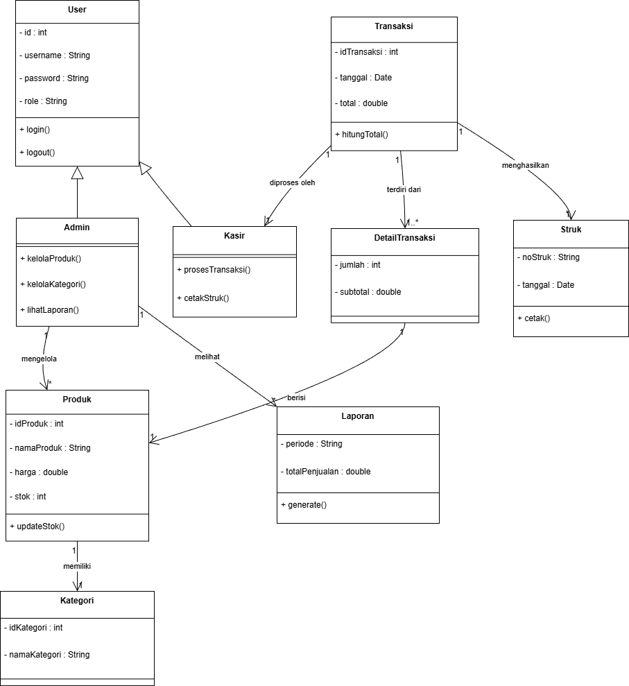

# Laporan Praktikum Minggu 6
Topik: [Tuliskan judul topik, misalnya "Class dan Object"]

## Identitas
- Nama  : Muhammad Pandu Dewanata Yaseh Hidayat
- NIM   : 240202841
- Kelas : 3IKRA

---

## Tujuan
Mahasiswa mampu:

1. Mengidentifikasi kebutuhan sistem ke dalam diagram UML.

2. Menggambar UML Class Diagram dengan relasi antar class yang tepat.

3. Menjelaskan prinsip desain OOP (SOLID).

4. Menerapkan minimal dua prinsip SOLID dalam kode program.
---

## Dasar Teori
1. UML (Unified Modeling Language) adalah bahasa standar untuk memodelkan sistem perangkat lunak secara visual.

2. Use Case Diagram menggambarkan fungsionalitas sistem dari perspektif pengguna (aktor).

3. Activity Diagram menggambarkan alur kerja atau proses bisnis dalam sistem.

4. Sequence Diagram menggambarkan interaksi antar objek dalam urutan waktu.

5. Class Diagram menggambarkan struktur kelas, atribut, metode, dan hubungan antar kelas.

6. SOLID Principles adalah lima prinsip desain berorientasi objek yang meningkatkan fleksibilitas, pemeliharaan, dan skalabilitas kode.

---

## Langkah Praktikum
1. Analisis Kebutuhan Sistem Agri-POS berdasarkan deskripsi tugas.

2. Membuat Use Case Diagram dengan tool draw.io berdasarkan referensi gambar yang diberikan.

3. Membuat Activity Diagram untuk proses Checkout dengan swimlane Kasir, Sistem, dan Payment Gateway.

4. Membuat Sequence Diagram untuk proses pembayaran dengan alternatif gagal.

5. Membuat Class Diagram lengkap dengan atribut, metode, relasi, dan penerapan SOLID.

6. Menyusun Laporan dengan penjelasan setiap diagram dan penerapan SOLID.
---

## UML
(Sertakan screenshot hasil eksekusi program.  

)
---

## Analisis
1. Konsistensi Diagram: Semua diagram saling melengkapi dan konsisten dalam penamaan aktor, use case, dan kelas.

2. Penerapan SOLID: Prinsip OCP dan DIP diterapkan dengan jelas pada sistem pembayaran, memudahkan penambahan metode baru.

3. Kendala: Membuat Activity Diagram yang detail dengan alternatif gagal membutuhkan pemikiran ekstra untuk mencakup semua skenario.

4. Solusi: Menggunakan tool draw.io dengan template UML yang rapi dan iterasi revisi.
---

## Kesimpulan
Dengan menggunakan empat diagram UML (Use Case, Activity, Sequence, Class) dan menerapkan prinsip SOLID, desain sistem Agri-POS menjadi lebih terstruktur, modular, dan mudah dikembangkan. Desain ini memenuhi kebutuhan fungsional dan non-fungsional, serta siap untuk pengembangan fitur tambahan di masa depan.

---

## Quiz
1. Jelaskan perbedaan aggregation dan composition serta berikan contoh penerapannya pada desain Anda.
Jawaban:
- Aggregation adalah hubungan “has-a” di mana objek anak dapat hidup mandiri tanpa objek induk. Contoh: Transaction memiliki Product (produk tetap ada meskipun transaksi dihapus).
- Composition adalah hubungan “part-of” di mana objek anak tidak dapat hidup tanpa objek induk. Contoh: DetailTransaksi adalah bagian dari Transaction (detail transaksi dihapus jika transaksi dihapus).

2. Bagaimana prinsip Open/Closed dapat memastikan sistem mudah dikembangkan?
Jawaban:
Prinsip Open/Closed memungkinkan sistem terbuka untuk ekstensi (dapat menambah fitur baru) tetapi tertutup untuk modifikasi (tidak mengubah kode lama). Contoh: Menambah QRISPayment tanpa mengubah PaymentService.

3. Mengapa Dependency Inversion Principle (DIP) meningkatkan testability? Berikan contoh penerapannya.
Jawaban:
DIP meningkatkan testability karena memisahkan ketergantungan pada implementasi konkrit, memungkinkan penggunaan mock object dalam pengujian. Contoh: PaymentService bergantung pada interface PaymentMethod, sehingga dapat diuji dengan MockPaymentMethod tanpa memanggil gateway nyata.

